..  docs/source/user_client/include_tabletdefs.rst

..  Copyright (C) 2012, University of Cambridge, Department of Psychiatry.
    Created by Rudolf Cardinal (rnc1001@cam.ac.uk).
    .
    This file is part of CamCOPS.
    .
    CamCOPS is free software: you can redistribute it and/or modify
    it under the terms of the GNU General Public License as published by
    the Free Software Foundation, either version 3 of the License, or
    (at your option) any later version.
    .
    CamCOPS is distributed in the hope that it will be useful,
    but WITHOUT ANY WARRANTY; without even the implied warranty of
    MERCHANTABILITY or FITNESS FOR A PARTICULAR PURPOSE. See the
    GNU General Public License for more details.
    .
    You should have received a copy of the GNU General Public License
    along with CamCOPS. If not, see <http://www.gnu.org/licenses/>.

.. role:: tabletcurrentpatient
.. role:: tabletnopatientselected
.. .. role:: tabletmenu
.. role:: missingtext
.. role:: unselectedtext
.. role:: selectedtext

.. The "tabletmenu" role is registered in conf.py, so we can use substitutions
   inside it.

.. https://stackoverflow.com/questions/4669689/how-to-use-color-in-text-with-restructured-text-rst2html-py-or-how-to-insert-h
.. https://stackoverflow.com/questions/3702865/sphinx-restructuredtext-set-color-for-a-single-word/9753677
.. then see conf.py for the CSS

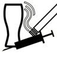

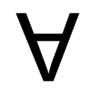

.. |anonymous| image:: ../_app_icons/anonymous.png
   :align: middle
   :height: 48px
   :width: 48px

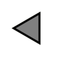

.. |camcops| image:: ../_app_icons/camcops.png
   :align: middle
   :height: 24px
   :width: 24px

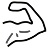

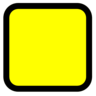

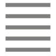

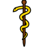

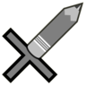

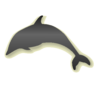

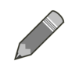

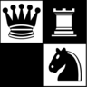

.. |field_incomplete_optional| image:: ../_app_icons/field_incomplete_optional.png
   :align: middle
   :height: 24px
   :width: 24px

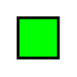

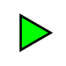

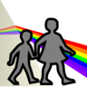

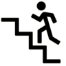

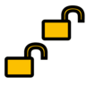

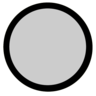

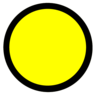

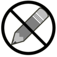

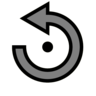

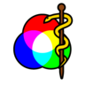

.. |sets_research| image:: ../_app_icons/sets_research.png
   :align: middle
   :height: 48px
   :width: 48px

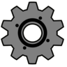

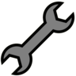

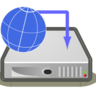

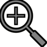
