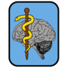

..  docs/source/user_client/include_bootstrap_icons.rst
..  Copyright (C) 2012, University of Cambridge, Department of Psychiatry.
    Created by Rudolf Cardinal (rnc1001@cam.ac.uk).
    .
    This file is part of CamCOPS.
    .
    CamCOPS is free software: you can redistribute it and/or modify
    it under the terms of the GNU General Public License as published by
    the Free Software Foundation, either version 3 of the License, or
    (at your option) any later version.
    .
    CamCOPS is distributed in the hope that it will be useful,
    but WITHOUT ANY WARRANTY; without even the implied warranty of
    MERCHANTABILITY or FITNESS FOR A PARTICULAR PURPOSE. See the
    GNU General Public License for more details.
    .
    You should have received a copy of the GNU General Public License
    along with CamCOPS. If not, see <http://www.gnu.org/licenses/>.

..  Names should match camcops_server.cc_modules.cc_pyramid.Icons for
    consistency.

.. Ours:

.. Bootstrap:

.. |activity| raw:: html

    <i role="img" class="bi-activity"></i>

.. |app_authenticator| raw:: html

    <i role="img" class="bi-shield-shaded"></i>

.. |audit_item| raw:: html

    <i role="img" class="bi-tag"></i>

.. |audit_menu| raw:: html

    <i role="img" class="bi-clipboard"></i>

.. |audit_options| raw:: html

    <i role="img" class="bi-clipboard-check"></i>

.. |audit_report| raw:: html

    <i role="img" class="bi-clipboard-data"></i>

.. |busy| raw:: html

    <i role="img" class="bi-hourglass-split"></i>

.. |complete| raw:: html

    <i role="img" class="bi-check"></i>

.. |ctv| raw:: html

    <i role="img" class="bi-body-text"></i>

.. |delete| raw:: html

    <i role="img" class="bi-trash"></i>

.. |delete_major| raw:: html

    <i role="img" class="bi-trash-fill"></i>

.. |developer| raw:: html

    <i role="img" class="bi-braces"></i>

.. |download| raw:: html

    <i role="img" class="bi-download"></i>

.. |due| raw:: html

    <i role="img" class="bi-alarm"></i>

.. |dump_basic| raw:: html

    <i role="img" class="bi-file-spreadsheet"></i>

.. |dump_sql| raw:: html

    <i role="img" class="bi-server"></i>

.. |edit| raw:: html

    <i role="img" class="bi-pencil"></i>

.. |email_configure| raw:: html

    <i role="img" class="bi-at"></i>

.. |email_send| raw:: html

    <i role="img" class="bi-envelope"></i>

.. |email_view| raw:: html

    <i role="img" class="bi-envelope-open"></i>

.. |export_recipient| raw:: html

    <i role="img" class="bi-share"></i>

.. |exported_task| raw:: html

    <i role="img" class="bi-tag-fill"></i>

.. |exported_task_entry_collection| raw:: html

    <i role="img" class="bi-tags"></i>

.. |filter| raw:: html

    <i role="img" class="bi-funnel"></i>

.. |force_finalize| raw:: html

    <i role="img" class="bi-bricks"></i>

.. |github| raw:: html

    <i role="img" class="bi-github"></i>

.. |goto_predecessor| raw:: html

    <i role="img" class="bi-arrow-left-square"></i>

.. |goto_successor| raw:: html

    <i role="img" class="bi-arrow-right-square-fill"></i>

.. |group_add| raw:: html

    <i role="img" class="bi-plus-circle"></i>

.. |group_admin| raw:: html

    <i role="img" class="bi-suit-diamond-fill"></i>

.. |group_edit| raw:: html

    <i role="img" class="bi-box"></i>

.. |groups| raw:: html

    <i role="img" class="bi-boxes"></i>

.. |home| raw:: html

    <i role="img" class="bi-house-fill"></i>

.. |html_anonymous| raw:: html

    <i role="img" class="bi-file-richtext"></i>

.. |html_identifiable| raw:: html

    <i role="img" class="bi-file-richtext-fill"></i>

.. |id_definition_add| raw:: html

    <i role="img" class="bi-plus-circle"></i>

.. |id_definitions| raw:: html

    <i role="img" class="bi-123"></i>

.. |incomplete| raw:: html

    <i role="img" class="bi-x-circle"></i>

.. |info_external| raw:: html

    <i role="img" class="bi-info-circle-fill"></i>

.. |info_internal| raw:: html

    <i role="img" class="bi-info-circle"></i>

.. |json| raw:: html

    <i role="img" class="bi-file-text-fill"></i>

.. |login| raw:: html

    <i role="img" class="bi-box-arrow-in-right"></i>

.. |logout| raw:: html

    <i role="img" class="bi-box-arrow-right"></i>

.. |mfa| raw:: html

    <i role="img" class="bi-fingerprint"></i>

.. |missing| raw:: html

    <i role="img" class="bi-x-octagon-fill"></i>

.. |navigate_backward| raw:: html

    <i role="img" class="bi-skip-start"></i>

.. |navigate_end| raw:: html

    <i role="img" class="bi-skip-forward"></i>

.. |navigate_forward| raw:: html

    <i role="img" class="bi-skip-end"></i>

.. |navigate_start| raw:: html

    <i role="img" class="bi-skip-backward"></i>

.. |password_other| raw:: html

    <i role="img" class="bi-key"></i>

.. |password_own| raw:: html

    <i role="img" class="bi-key-fill"></i>

.. |patient| raw:: html

    <i role="img" class="bi-person"></i>

.. |patient_add| raw:: html

    <i role="img" class="bi-person-plus"></i>

.. |patient_edit| raw:: html

    <i role="img" class="bi-person-circle"></i>

.. |patients| raw:: html

    <i role="img" class="bi-people"></i>

.. |pdf_anonymous| raw:: html

    <i role="img" class="bi-file-pdf"></i>

.. |pdf_identifiable| raw:: html

    <i role="img" class="bi-file-pdf-fill"></i>

.. |report_config| raw:: html

    <i role="img" class="bi-bar-chart-line"></i>

.. |report_detail| raw:: html

    <i role="img" class="bi-file-bar-graph"></i>

.. |reports| raw:: html

    <i role="img" class="bi-bar-chart-line-fill"></i>

.. |settings| raw:: html

    <i role="img" class="bi-gear"></i>

.. |sms| raw:: html

    <i role="img" class="bi-chat-left-dots"></i>

.. |special_note| raw:: html

    <i role="img" class="bi-pencil-square"></i>

.. |success| raw:: html

    <i role="img" class="bi-check-circle"></i>

.. |superuser| raw:: html

    <i role="img" class="bi-suit-spade-fill"></i>

.. |task_schedule| raw:: html

    <i role="img" class="bi-journal"></i>

.. |task_schedule_add| raw:: html

    <i role="img" class="bi-journal-plus"></i>

.. |task_schedule_item_add| raw:: html

    <i role="img" class="bi-journal-code"></i>

.. |task_schedule_items| raw:: html

    <i role="img" class="bi-journal-text"></i>

.. |task_schedules| raw:: html

    <i role="img" class="bi-journals"></i>

.. |trackers| raw:: html

    <i role="img" class="bi-graph-up"></i>

.. |unknown| raw:: html

    <i role="img" class="bi-question-circle"></i>

.. |unlock| raw:: html

    <i role="img" class="bi-unlock"></i>

.. |upload| raw:: html

    <i role="img" class="bi-upload"></i>

.. |user_add| raw:: html

    <i role="img" class="bi-person-plus-fill"></i>

.. |user_info| raw:: html

    <i role="img" class="bi-person-badge"></i>

.. |user_management| raw:: html

    <i role="img" class="bi-person-badge-fill"></i>

.. |user_permissions| raw:: html

    <i role="img" class="bi-person-check"></i>

.. |view_tasks| raw:: html

    <i role="img" class="bi-display"></i>

.. |xml| raw:: html

    <i role="img" class="bi-file-code-fill"></i>

.. |you| raw:: html

    <i role="img" class="bi-heart-fill"></i>

.. |zoom_in| raw:: html

    <i role="img" class="bi-zoom-in"></i>

.. |zoom_out| raw:: html

    <i role="img" class="bi-zoom-out"></i>
