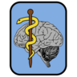
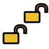
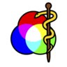
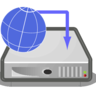

..  client/include_tabletdefs.rst

..  Copyright (C) 2012-2018 Rudolf Cardinal (rudolf@pobox.com).
    This file is part of CamCOPS.
    CamCOPS is free software: you can redistribute it and/or modify
    it under the terms of the GNU General Public License as published by
    the Free Software Foundation, either version 3 of the License, or
    (at your option) any later version.
    CamCOPS is distributed in the hope that it will be useful,
    but WITHOUT ANY WARRANTY; without even the implied warranty of
    MERCHANTABILITY or FITNESS FOR A PARTICULAR PURPOSE. See the
    GNU General Public License for more details.
    You should have received a copy of the GNU General Public License
    along with CamCOPS. If not, see <http://www.gnu.org/licenses/>.

.. role:: tabletcurrentpatient
.. role:: tabletnopatientselected
.. .. role:: tabletmenu
.. role:: missingtext

.. The "tabletmenu" role is registered in conf.py, so we can use substitutions
   inside it.

.. https://stackoverflow.com/questions/4669689/how-to-use-color-in-text-with-restructured-text-rst2html-py-or-how-to-insert-h
.. https://stackoverflow.com/questions/3702865/sphinx-restructuredtext-set-color-for-a-single-word/9753677
.. then see conf.py for the CSS

.. |addiction| image:: app_icons/addiction.png
   :align: middle
   :height: 24px
   :width: 24px

.. |add| image:: app_icons/add.png
   :align: middle
   :height: 24px
   :width: 24px

.. |alltasks| image:: app_icons/alltasks.png
   :align: middle
   :height: 24px
   :width: 24px

.. |back| image:: app_icons/back.png
   :align: middle
   :height: 24px
   :width: 24px

.. |camera| image:: app_icons/camera.png
   :align: middle
   :height: 24px
   :width: 24px

.. |cancel| image:: app_icons/cancel.png
   :align: middle
   :height: 24px
   :width: 24px

.. |catatonia| image:: app_icons/catatonia.png
   :align: middle
   :height: 24px
   :width: 24px

.. |chain| image:: app_icons/chain.png
   :align: middle
   :height: 24px
   :width: 24px

.. |check_disabled| image:: app_icons/check_disabled.png
   :align: middle
   :height: 24px
   :width: 24px

.. |check_false_red| image:: app_icons/check_false_red.png
   :align: middle
   :height: 24px
   :width: 24px

.. |check_true_black| image:: app_icons/check_true_black.png
   :align: middle
   :height: 24px
   :width: 24px

.. |check_unselected_required| image:: app_icons/check_unselected_required.png
   :align: middle
   :height: 24px
   :width: 24px

.. |choose_page| image:: app_icons/choose_page.png
   :align: middle
   :height: 24px
   :width: 24px

.. |choose_patient| image:: app_icons/choose_patient.png
   :align: middle
   :height: 24px
   :width: 24px

.. |clinical| image:: app_icons/clinical.png
   :align: middle
   :height: 24px
   :width: 24px

.. |cognitive| image:: app_icons/cognitive.png
   :align: middle
   :height: 24px
   :width: 24px

.. |delete| image:: app_icons/delete.png
   :align: middle
   :height: 24px
   :width: 24px

.. |edit| image:: app_icons/edit.png
   :align: middle
   :height: 24px
   :width: 24px

.. |executive| image:: app_icons/executive.png
   :align: middle
   :height: 24px
   :width: 24px

.. |fast_forward| image:: app_icons/fast_forward.png
   :align: middle
   :height: 24px
   :width: 24px

.. |field_incomplete_optional| image:: app_icons/field_incomplete_optional.png
   :align: middle
   :height: 24px
   :width: 24px

.. |field_problem| image:: app_icons/field_problem.png
   :align: middle
   :height: 24px
   :width: 24px

.. |finishflag| image:: app_icons/finishflag.png
   :align: middle
   :height: 24px
   :width: 24px

.. |finish| image:: app_icons/finish.png
   :align: middle
   :height: 24px
   :width: 24px

.. |global| image:: app_icons/global.png
   :align: middle
   :height: 24px
   :width: 24px

.. |hasChild| image:: app_icons/hasChild.png
   :align: middle
   :height: 24px
   :width: 24px

.. |hasParent| image:: app_icons/hasParent.png
   :align: middle
   :height: 24px
   :width: 24px

.. |info| image:: app_icons/info.png
   :align: middle
   :height: 24px
   :width: 24px

.. |locked| image:: app_icons/locked.png
   :align: middle
   :height: 24px
   :width: 24px

.. |magnify| image:: app_icons/magnify.png
   :align: middle
   :height: 24px
   :width: 24px

.. |next| image:: app_icons/next.png
   :align: middle
   :height: 24px
   :width: 24px

.. |ok| image:: app_icons/ok.png
   :align: middle
   :height: 24px
   :width: 24px

.. |patient_summary| image:: app_icons/patient_summary.png
   :align: middle
   :height: 24px
   :width: 24px

.. |personality| image:: app_icons/personality.png
   :align: middle
   :height: 24px
   :width: 24px

.. |psychosis| image:: app_icons/psychosis.png
   :align: middle
   :height: 24px
   :width: 24px

.. |radio_disabled| image:: app_icons/radio_disabled.png
   :align: middle
   :height: 24px
   :width: 24px

.. |radio_selected| image:: app_icons/radio_selected.png
   :align: middle
   :height: 24px
   :width: 24px

.. |radio_unselected| image:: app_icons/radio_unselected.png
   :align: middle
   :height: 24px
   :width: 24px

.. |radio_unselected_required| image:: app_icons/radio_unselected_required.png
   :align: middle
   :height: 24px
   :width: 24px

.. |read_only| image:: app_icons/read_only.png
   :align: middle
   :height: 24px
   :width: 24px

.. |research| image:: app_icons/research.png
   :align: middle
   :height: 24px
   :width: 24px

.. |rotate_anticlockwise| image:: app_icons/rotate_anticlockwise.png
   :align: middle
   :height: 24px
   :width: 24px

.. |rotate_clockwise| image:: app_icons/rotate_clockwise.png
   :align: middle
   :height: 24px
   :width: 24px

.. |sets_research| image:: app_icons/sets_research.png
   :align: middle
   :height: 24px
   :width: 24px

.. |settings| image:: app_icons/settings.png
   :align: middle
   :height: 24px
   :width: 24px

.. |spanner| image:: app_icons/spanner.png
   :align: middle
   :height: 24px
   :width: 24px

.. |speaker_playing| image:: app_icons/speaker_playing.png
   :align: middle
   :height: 24px
   :width: 24px

.. |speaker| image:: app_icons/speaker.png
   :align: middle
   :height: 24px
   :width: 24px

.. |stop| image:: app_icons/stop.png
   :align: middle
   :height: 24px
   :width: 24px

.. |time_now| image:: app_icons/time_now.png
   :align: middle
   :height: 24px
   :width: 24px

.. |treeview| image:: app_icons/treeview.png
   :align: middle
   :height: 24px
   :width: 24px

.. |unlocked| image:: app_icons/unlocked.png
   :align: middle
   :height: 24px
   :width: 24px

.. |warning| image:: app_icons/warning.png
   :align: middle
   :height: 24px
   :width: 24px

.. |zoom| image:: app_icons/zoom.png
   :align: middle
   :height: 24px
   :width: 24px

