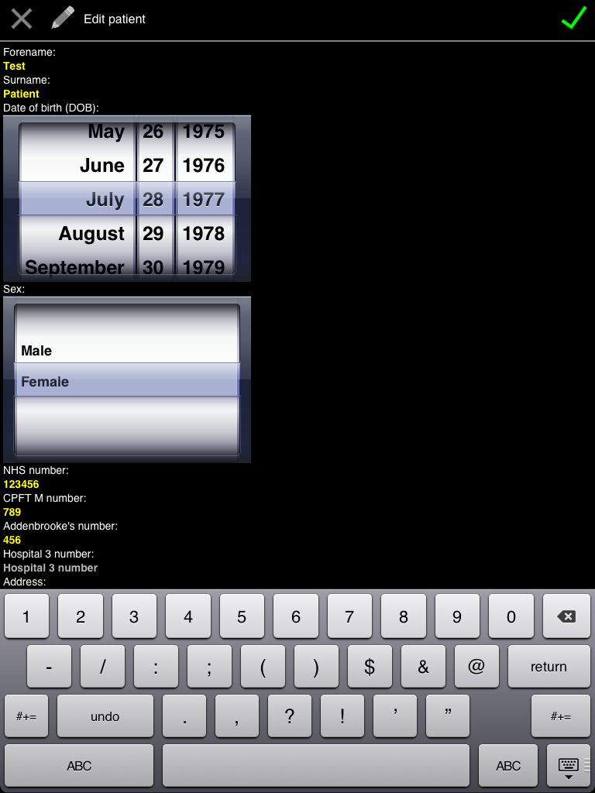
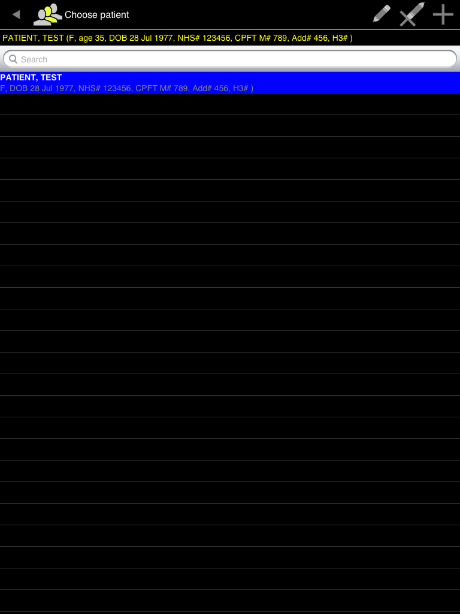
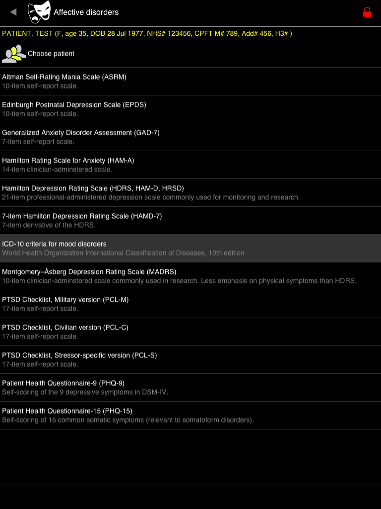
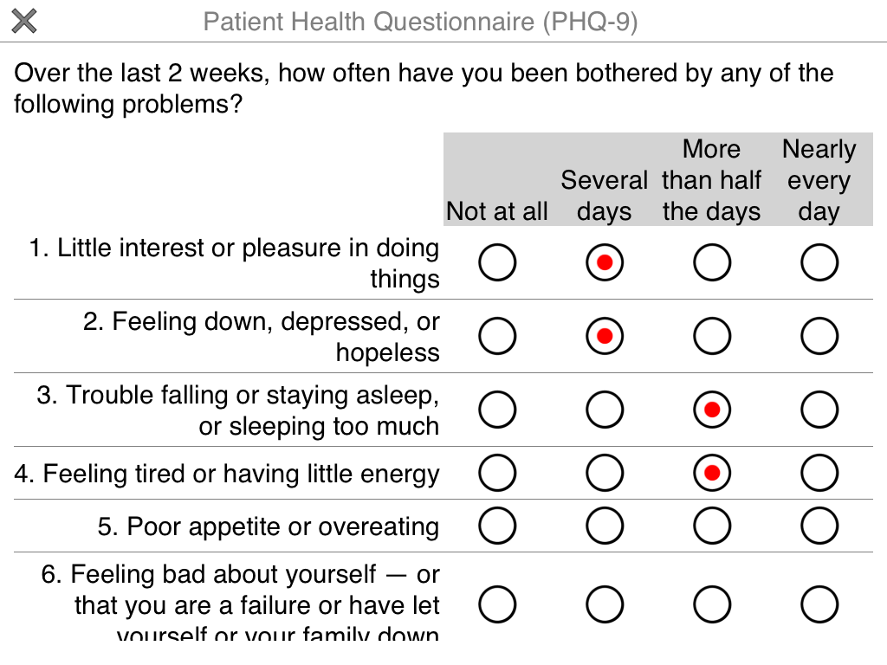
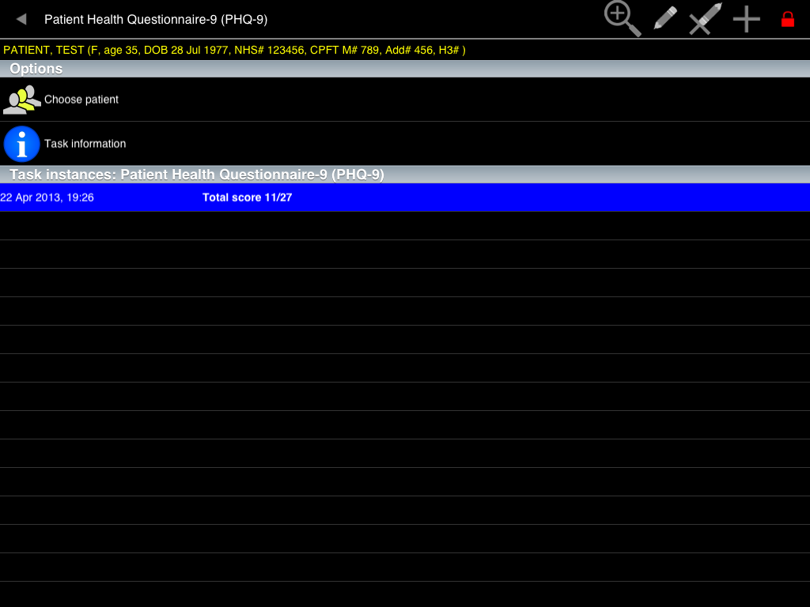
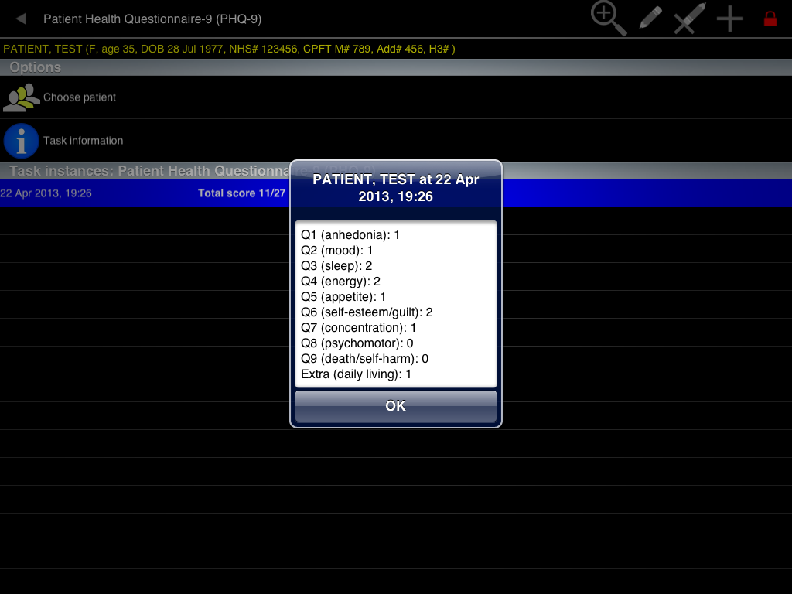
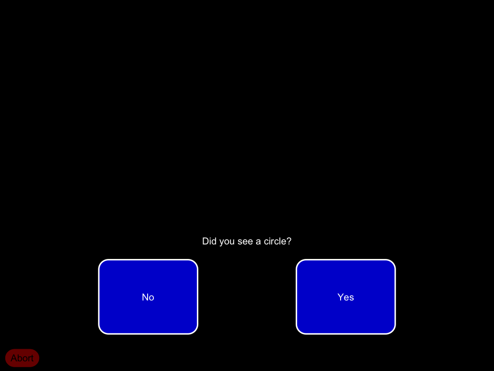
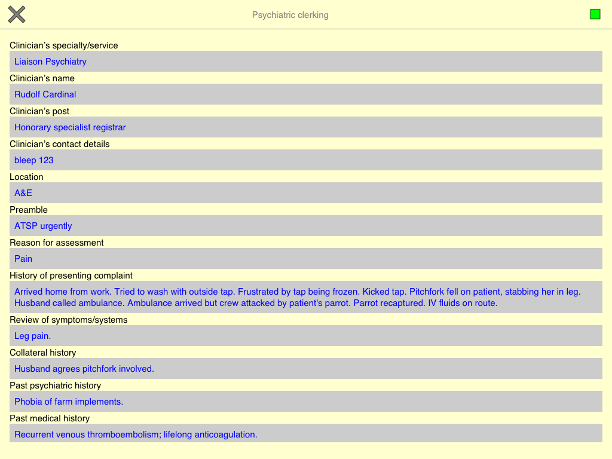
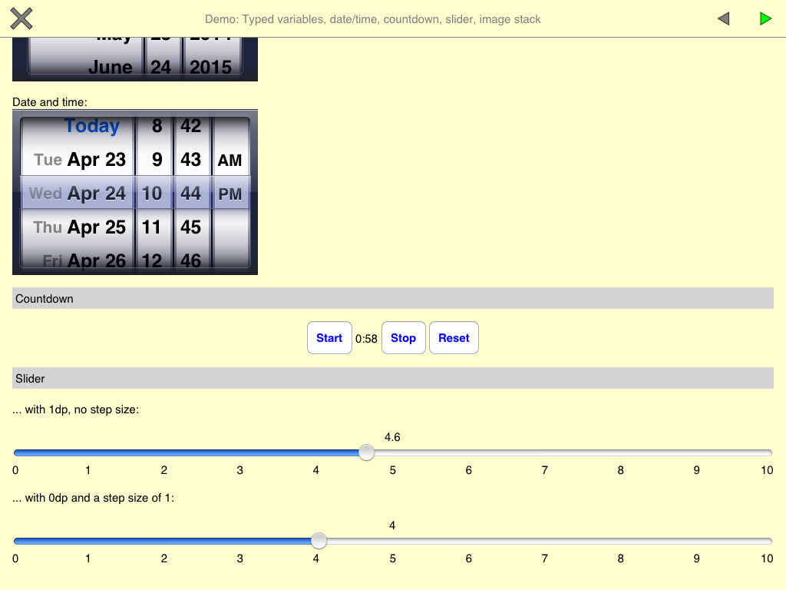

..  documentation/source/introduction/tour.rst

..  Copyright (C) 2012-2018 Rudolf Cardinal (rudolf@pobox.com).
    .
    This file is part of CamCOPS.
    .
    CamCOPS is free software: you can redistribute it and/or modify
    it under the terms of the GNU General Public License as published by
    the Free Software Foundation, either version 3 of the License, or
    (at your option) any later version.
    .
    CamCOPS is distributed in the hope that it will be useful,
    but WITHOUT ANY WARRANTY; without even the implied warranty of
    MERCHANTABILITY or FITNESS FOR A PARTICULAR PURPOSE. See the
    GNU General Public License for more details.
    .
    You should have received a copy of the GNU General Public License
    along with CamCOPS. If not, see <http://www.gnu.org/licenses/>.

.. _tour:

Tour
====

.. todo::
    This tour is a little outdated; apologies! The screenshots are of the older
    Javascript/Titanium application, not the newer C++/Qt application, and the
    server front end has also improved. We'll update this when we can.

**The main menu.** No patient is selected. The application is locked (red
padlock at top right). This is how the application starts. Touch the padlock to
unlock.

.. image:: screenshots/01_main_menu_locked.png
   :align: center
   :width: 80%

**Unlocked.** The first time you run the application, there is no code to
unlock it. Later, you will set one. For now, click 'Choose patient'.

.. image:: screenshots/02_main_menu_unlocked.png
   :align: center
   :width: 80%

**Choose patient.** There are no patients yet. Press the + to add one.

.. image:: screenshots/03_choose_patient_no_patients.png
   :align: center
   :width: 80%

**Add patient.** Enter some details. Touch the X to cancel or the green tick to
save.

**Choose patient.** Now we have a test patient, and she is selected.

**Choose patient.** Touch the patient rows to select and deselect them.

.. image:: screenshots/06_patient_unselected.png
   :align: center
   :width: 80%

**Patient summary.** Having selected the patient (note the line near the
top indicating which patient is selected), return to the main menu and
choose 'Patient summary'. This patient has no task instances yet.

.. image:: screenshots/07_patient_summary_no_tasks.png
   :align: center
   :width: 80%

**Main menu.** Having chosen a patient, touch the padlock again to lock the
application. In the locked state, no other patient details can be viewed,
so you can give the tablet to the patient to perform a task (presuming
there is no other sensitive information on it!). Let's choose the
'Affective' menu.

.. image:: screenshots/08_main_menu_patient_selected.png
   :align: center
   :width: 80%

**Affective disorders.** There's a list of tasks. (THIS DEMONSTRATION LIST
DOES NOT NECESSARILY INDICATE TASKS PRESENT IN THE APPLICATION.) Choose
'PHQ-9'.

**PHQ-9 menu screen.** For each task, you can see options to choose a
patient, and view information about the task. This patient has no
instances of the PHQ-9 task yet.

.. image:: screenshots/10_phq9_task_menu.png
   :align: center
   :width: 80%

**PHQ-9 information.** The information screen gives details of the tasks,
with links and references. Return to the task screen and touch the +
symbol to add a new PHQ-9 task.

.. image:: screenshots/11_phq9_task_info.png
   :align: center
   :width: 80%

**PHQ-9 task (1 of 2).** Here's the PHQ-9 screen. It's in a big font at the
moment! Touch the options to respond to the questions. White backgrounds
indicate screens for the patient to complete.

**PHQ-9 task (2 of 2).** When sufficient information has been entered, a
green 'stop' square appears at the top right. Press that to complete the
task.

.. image:: screenshots/13_phq9_bottom.png
   :align: center
   :width: 80%

**PHQ-9 menu screen.** Now our patient has a PHQ-9 instance listed. Touch
it to select it.

.. image:: screenshots/14_phq9_task_menu_with_task.png
   :align: center
   :width: 80%

**PHQ-9 screen, task selected.** When this row is selected, additional
icons appear at the top right. Touch the magnifying glass to view more
detail.

**Viewing options for a PHQ-9 task.** Most tasks let you view a 'Facsimile'
of the task as if you were performing it, or see a 'Summary'.

.. image:: screenshots/16_phq9_view_task.png
   :align: center
   :width: 80%

**PHQ-9 summary (1 of 2).** Here's part of the summary. You can see the raw
answers...

**PHQ-9 summary (2 of 2).** ... and some automated scoring. However, it's
not very sophisticated. We'll see something better later on.

.. image:: screenshots/18_phq9_summary_b.png
   :align: center
   :width: 80%

**PHQ-9 facsimile.** Here's the facsimile, a read-only copy of what we saw
earlier. Now, let's change the font size. Back to the main menu, and choose
'Settings'.

.. image:: screenshots/19_phq9_facsimile.png
   :align: center
   :width: 80%

**Application locked.** Ah. We can't change the settings, because we've
locked the application to this patient. Touch the padlock to unlock.

.. image:: screenshots/20_unable_locked.png
   :align: center
   :width: 80%

**Settings.** Now we can get to the settings menu. Choose
'Questionnaire/task appearance'.

.. image:: screenshots/21_settings_menu.png
   :align: center
   :width: 80%

**Questionnaire/task appearance.** Use the slider to set the font size.

.. image:: screenshots/22_questionnaire_settings.png
   :align: center
   :width: 80%

**GAD-7 (now with smaller font).** Here's the GAD-7 task, accessible from
the 'Affective' menu, with our new font size.

.. image:: screenshots/23_phq9_smaller_font.png
   :align: center
   :width: 80%

**BPRS.** The BPRS (accessible from the 'Global function...' menu) is
clinician-administered, so it has a different background colour. Also, it's
a multi-page task; a green 'Next' arrow appears at the top right when you
can progress (and a 'Back' arrow on subsequent pages), replaced by the
'Stop' symbol when you've come to the end.

.. image:: screenshots/24_bprs_q1.png
   :align: center
   :width: 80%

**Patient summary.** Having run three tasks, we now have something more
interesting in our 'Patient summary'.

.. image:: screenshots/25_patient_summary_with_tasks.png
   :align: center
   :width: 80%

**Expectation-Detection Threshold task (1 of 5).** Before we look at the
upload process, let's glance at a few more tasks. This one is on the
'Research' menu.

.. image:: screenshots/26_expdetthreshold_a.png
   :align: center
   :width: 80%

**Expectation-Detection Threshold task (2 of 5).** It assesses the ability
to detect a stimulus in noise.

.. image:: screenshots/27_expdetthreshold_b.png
   :align: center
   :width: 80%

**Expectation-Detection Threshold task (3 of 5).** Participants respond on
the buttons for a while...

**Expectation-Detection Threshold task (4 of 5).** ... finally reaching the
end...

.. image:: screenshots/29_expdetthreshold_d.png
   :align: center
   :width: 80%

**Expectation-Detection Threshold task (5 of 5).** ... and a task summary
appears as usual. This is dull, but we'll see a fancier view of it later.

.. image:: screenshots/30_expdetthreshold_e.png
   :align: center
   :width: 80%

**Clerking template.** On the 'Clinical' menu are some simple templates for
clinical assessment.

**Help menu.** On the 'Help' menu, there's a demonstration task.

.. image:: screenshots/32_help_menu.png
   :align: center
   :width: 80%

**Demo (1 of 9).** Let's look at this; it shows the elements that
questionnaire-style tasks can be built from.

.. image:: screenshots/33_demo_a.png
   :align: center
   :width: 80%

**Demo (2 of 9).** Types of multiple-choice question.

.. image:: screenshots/34_demo_b.png
   :align: center
   :width: 80%

**Demo (3 of 9).** MCQs with boolean (yes/no) options; subtitles in grids;
n-from-many questions.

.. image:: screenshots/35_demo_c.png
   :align: center
   :width: 80%

**Demo (4 of 9).** Images, boolean (yes/no) images, boolean text,
photograph-taking using the tablet's camera.

.. image:: screenshots/36_demo_d.png
   :align: center
   :width: 80%

**Demo (5 of 9).** Text, multiline text, numerical validation, dates and
times.

.. image:: screenshots/37_demo_e.png
   :align: center
   :width: 80%

**Demo (6 of 9).** Timers, sliders, ...

**Demo (7 of 9).** ... and an image stack.

.. image:: screenshots/39_demo_f.png
   :align: center
   :width: 80%

**Demo (8 of 9).** A sketching canvas.

.. image:: screenshots/40_demo_g.png
   :align: center
   :width: 80%

**Demo (9 of 9).** You can play sounds, too (not live on this web site!).

.. image:: screenshots/41_demo_h.png
   :align: center
   :width: 80%

**User settings.** Back to the 'Settings' menu, then choose 'User
settings'. Some things are cosmetic (device friendly name, default
clinician information) but the USERNAME and PASSWORD are important for
talking to the server.

.. image:: screenshots/42_user_settings.png
   :align: center
   :width: 80%

**Intellectual property settings.** Also on the 'Settings' menu, this
governs what tasks you may run. Some tasks will not run, for example, in a
commercial environment, or if the application doesn't know if it's in a
commercial environment or not. BEING DISHONEST HERE MAY CAUSE YOU TO BREAK
THE LAW.

.. image:: screenshots/43_ip_settings.png
   :align: center
   :width: 80%

**Privileged mode.** Before we can edit the access codes or server
settings, we must be in Privileged mode. Touch 'Set privileged mode' and
note the change in the padlock at the top right.

.. image:: screenshots/44_privileged_mode.png
   :align: center
   :width: 80%

**Set access codes.** Set the access codes to unlock and to set privileged
mode.

.. image:: screenshots/45_access_codes.png
   :align: center
   :width: 80%

**Server settings.** Set these carefully. They determine which server the
tablet will talk to.

.. image:: screenshots/46_server_settings.png
   :align: center
   :width: 80%

**Registering...*** When you point the device at a server for the first
time, you must register the device with the server (and your username must
be approved to register new devices).

.. image:: screenshots/47_registering.png
   :align: center
   :width: 80%

**Successful registration.** This server liked us.

.. image:: screenshots/48_registered.png
   :align: center
   :width: 80%

**Upload.** Now touch 'Upload...' on the main menu, and the data will be
squirted over to the server via a secure link.

.. image:: screenshots/49_uploading.png
   :align: center
   :width: 80%

**Web viewer.** OK, let's move from the tablet application to a web
browser, and log in to our CamCOPS server via a secure link.

.. image:: screenshots/50_webview_login.png
   :align: center
   :width: 80%

**Web viewer: main menu.** Of most interest: 'View tasks'.

.. image:: screenshots/51_webview_main_menu.png
   :align: center
   :width: 80%

**View tasks.** We can filter in a number of ways. Each task has a 'PDF'
and an 'HTML' option.

.. image:: screenshots/52_webview_view_tasks.png
   :align: center
   :width: 80%

**PHQ-9 PDF.** Here's the PHQ-9 task we ran earlier, in a PDF format
suitable for printing. You can see the raw results, and some automatic
interpretation.

.. image:: screenshots/53_webview_phq9_pdf.png
   :align: center
   :width: 80%

**PHQ-9 HTML.** Here's the same task in HTML format; this is quicker to
browse, but less suited to printing (it won't follow the rules of having
patient identifiers on each page).

.. image:: screenshots/54_webview_phq9_html.png
   :align: center
   :width: 80%

**Clerking PDF.** Here's our mock clerking in PDF format. Note the headers
on each page.

.. image:: screenshots/55_webview_clerking_pdf.png
   :align: center
   :width: 80%

**Expectation-Detection Threshold (1 of 2).** Some research tasks give
inordinate detail...

.. image:: screenshots/56_webview_expdetthreshold_a.png
   :align: center
   :width: 80%

**Expectation-Detection Threshold (2 of 2).** ... and can automatically
plot their results. Here's a plot of intensity against trial number, and a
logistic fit to the data, showing the subject's psychometric function.

.. image:: screenshots/57_webview_expdetthreshold_b.png
   :align: center
   :width: 80%

**The underlying database.** Under the bonnet, CamCOPS uses standard
relational databases on the tablets and on the server. Here's a MySQL
console on the server.

.. image:: screenshots/58_mysql.png
   :align: center
   :width: 80%

**Analysis using R.** It's easy to fetch data from the CamCOPS database
into sophisticated analytical tools like R.

.. image:: screenshots/59_R.png
   :align: center
   :width: 80%
